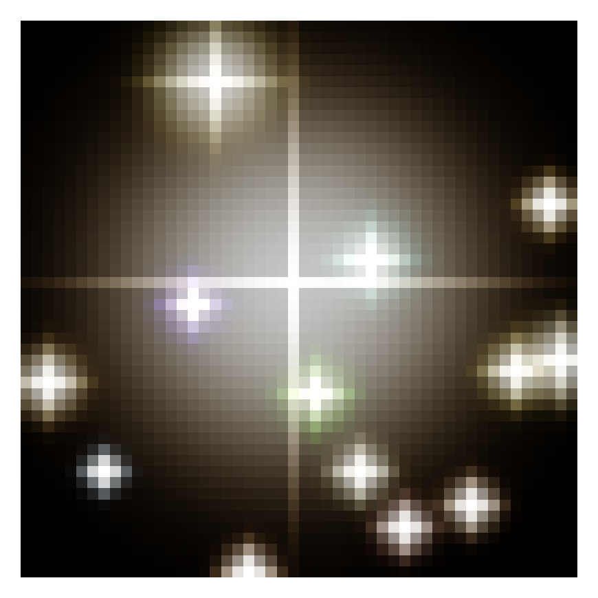

# AstroPixel

Repository for making pixel art out of real astronomical data. 

[Try out AstroPixel in colab!](https://colab.research.google.com/github/SpacialTree/astropixel/blob/main/notebooks/astropixel_example.ipynb)

